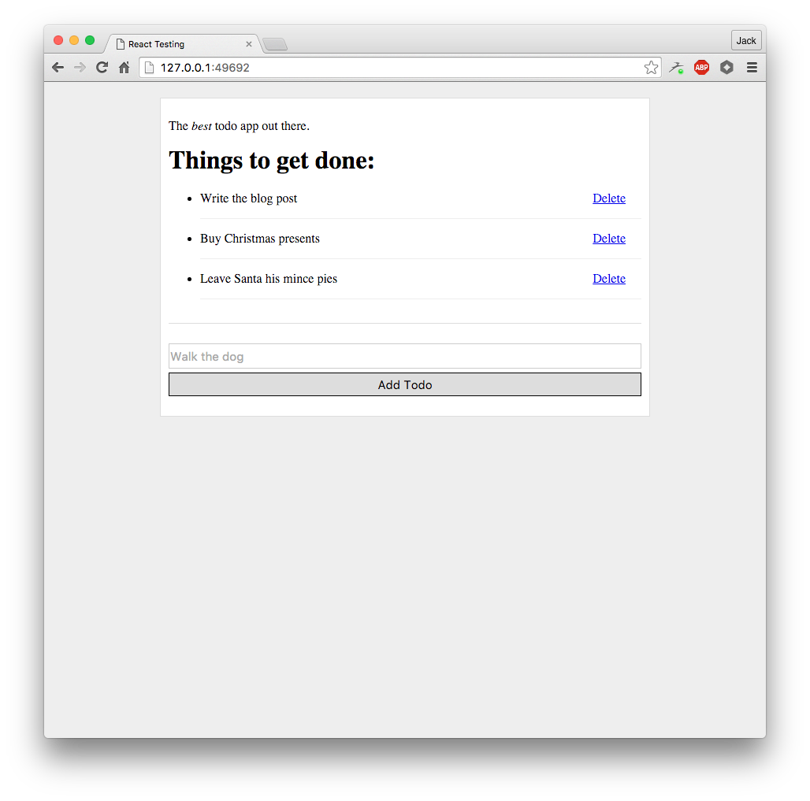

I've been spending a lot of 2015 spending a lot of time working with and writing about React, the library from Facebook for building web apps that needs no introduction. One thing I've yet to touch upon is testing, and today I'll share how I test React applications. There's lots of different approaches here, and there's no one right way to do it, but in this article I'll talk about my approach and preferred toolsets.

As an application to work with, I've picked a unique idea and built...a todo app! 

.

[I've also recorded a video](http://quick.as/om8s6xg7) that demonstrates the functionality of our app. It lets you toggle todos being done, add new todos and delete todos too. There's nothing revolutionary in the app but it will provide a nice base to test from. [You can grab all the code on GitHub](https://github.com/jackfranklin/todo-react-testing) too if you'd like to run it locally.

## Babel and ECMAScript 2015

I've written the entire application in ES2015 using [Babel](http://babeljs.io). I've installed all our dependencies through npm as Node modules and webpack converts those into client side compatible files that combine to run our app in the browser. The nice thing about installing all our dependencies in Node is we can then use all those dependencies again in our tests. Additionally, running our tests in NodeJS rather than in the browser means we can avoid the complexities of running in a browser and run them entirely in the terminal.

## Testing Libraries

My testing library of choice for NodeJS is [Tape](https://github.com/substack/tape). Tape has a minimal API that I find helps to keep tests clear and leads to better assertions. [Eric Elliott's post on Tape](https://medium.com/javascript-scene/why-i-use-tape-instead-of-mocha-so-should-you-6aa105d8eaf4) does a great job of summarising the reasons why Tape is a good choice, and hopefully I'll demonstrate them as we move through the article. It's worth noting that we're using Tape as a test runner here; if you have another preferred choce you could easily swap it out at this point.

I'll also use [Babel Tape Runner](https://github.com/wavded/babel-tape-runner), a small module that configures Tape and Babel nicely. Finally, we'll be using [jsdom](https://github.com/tmpvar/jsdom) because in some of our tests React will expect to be within a browser, and we can use jsdom to fake out a browser in NodeJS.

Let's get started by installing all those as developer dependencies. If you want to follow along you can [checkout the first commit on the demo repo](https://github.com/jackfranklin/todo-react-testing/commit/408de34721a9cbfe36c7d880897c792d1739b46b) which doesn't have any of the testing libraries installed.

```
npm install --save-dev tape babel-tape-runner jsdom
```

I've already got Babel and its presets configured but let's quickly cover it. We need Babel and two of its presets, es2015 and react, to ensure everything is transpiled as we need.

```
npm install --save-dev babel-preset-es2015 babel-preset-react babel-core
```

Then we'll create `.babelrc` and tell Babel that we want to use those presets:

```
{
  "presets": ["es2015", "react"]
}
```

Finally, let's set up npm so we can run `npm test` to execute our tests. Edit the `scripts` part of the `package.json` file:

```js
"scripts": {
  "test": "babel-tape-runner test/**/*-test.js"
},
```

This will get tape to run any files in the `test` directory that are suffixed with `-test`.

## The First Component Test

The first component we will be testing is the `Todo` component:

```js
import React from 'react';

export default class Todo  extends React.Component {
  toggleDone() {
    this.props.doneChange(this.props.todo.id);
  }

  deleteTodo(e) {
    e.preventDefault();
    this.props.deleteTodo(this.props.todo.id);
  }

  render() {
    const { todo } = this.props;

    const className = todo.done ? 'done-todo' : '';

    return (
      <div className={`todo ${className} todo-${todo.id}`}>
        <p className="toggle-todo" onClick={() => this.toggleDone() }>{ todo.name }</p>
        <a className="delete-todo" href="#" onClick={(e) => this.deleteTodo(e) }>Delete</a>
      </div>
    )
  }
}
```

This component is given a `todo` as a prop, and renders it. It also takes two callbacks through props which it calls when the user toggles a todo or deletes it. This pattern is fairly common; the `Todo` component doesn't directly manipulate the state of the world but instead calls up to a higher level component to do it. We'll see how this is done and how to test that later in this article. For now though, there's a few bits of functionality we need to test:

1. It renders the Todo correctly - we'll test this by checking the todo `name` property is rendered.
2. When a todo is done it gives it an extra class of `done-todo`, which causes the strike through.
2. When a todo is clicked on it is toggled.
3. When the delete link is clicked it deletes the todo.

We can test 1 by rendering the component and looking for the text we want. 2 and 3 are tested by triggering clicks on the HTML and checking the right callback is called.

Before we start testing there's one more component we need. React's test utilities used to ship as part of React but they are now separate, so we need to install them:

```
npm install --save-dev react-addons-test-utils
```

The TestUtils are [fully documented](https://facebook.github.io/react/docs/test-utils.html) on the React docs, and I recommend getting familiar with them. We'll use a few methods in this tutorial.

### Shallow Rendering

To test that the rendered component contains text we could use the React test utils to render the component to the DOM. However, the test utils also provide a method for shallow rendering. In shallow rendering you "render" the component, but only one level deep. This means no children are ever rendered, but also means that no DOM is required. React fakes the rendering, and returns you an object representing what would have been rendered. If you can write your tests like this it's encouraged, no DOM (or fake DOM) means that the tests will be a little more performant and this can add up if you have a huge number of them. First, let's create `test/todo-test.js` and do some set up:

```js
import React from 'react';
import Todo from '../app/todo';

import TestUtils from 'react-addons-test-utils';

import test from 'tape';

function shallowRenderTodo(todo) {
  const renderer = TestUtils.createRenderer();
  renderer.render(<Todo todo={todo} />);
  return renderer.getRenderOutput();
}
```

We import some required dependencies and then create the function `shallowRenderTodo`, which takes a todo object and returns a shallow rendered version of the `Todo` component that we can assert on. Now let's start with the tests:

```
test('Todo component', (t) => {
  t.test('rendering a not-done tweet', (t) => {
    const todo = { id: 1, name: 'Buy Milk', done: false };
    const result = shallowRenderTodo(todo);

    t.test('It renders the text of the todo', (t) => {
      t.plan(1);
      t.equal(result.props.children[0].props.children, 'Buy Milk');
    });
  });
});
```

Tape works by providing a `test` function that you call with a description and a callback, which Tape will call with an argument, which is commonly referred to as `t`. This is the object that you assert on or call `test` on to nest tests. In this test we first create a new todo and pass it to `shallowRenderTodo` to get a fake object that mirrors what would be rendered to a real DOM. Note the call to `t.plan`, Tape requires you to tell it how many assertions you're going to make. I've actually found this a really nice way to self document, and it also means Tape works with async tests out of the box - it will simply wait to allow async tests to execute.

